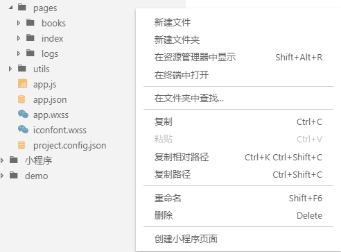

# weapp-quick-pages README

Visual Studio code extenstion that allows to quickly create  miniapp project pages templates and thinkphp project contrllor class file.

## Screenshots

## Available Commands

* Create miniapp project template page
* Create thinkphp project class file

## Features

### For more information

* [Visual Studio Code's Markdown Support](http://code.visualstudio.com/docs/languages/markdown)
* [Markdown Syntax Reference](https://help.github.com/articles/markdown-basics/)

